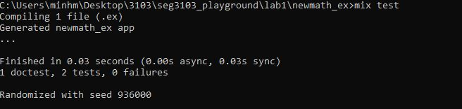

Lab1 TA zkaka044@uottawa.ca ;
Prof aforward@uottawa.ca <aforward@uottawa.ca>;
class csi 3103

### EXERCISE 1:
I am running java openjdk on version 15 

to run the java program in newmath_java first I compile it

Javac -encoding UTF-8 --source path src -d dist src/*.java

then I run it

java -cp ./dist Main

here is the output of the running program, below is the screenshot of the terminal

Junit
I am working with Junit5 (via vs studio code)
to run Junit I need to compile the application and then compile the test code
here is the output of the test

EXUnit 

Run the tests
Mix test

capture after run test

