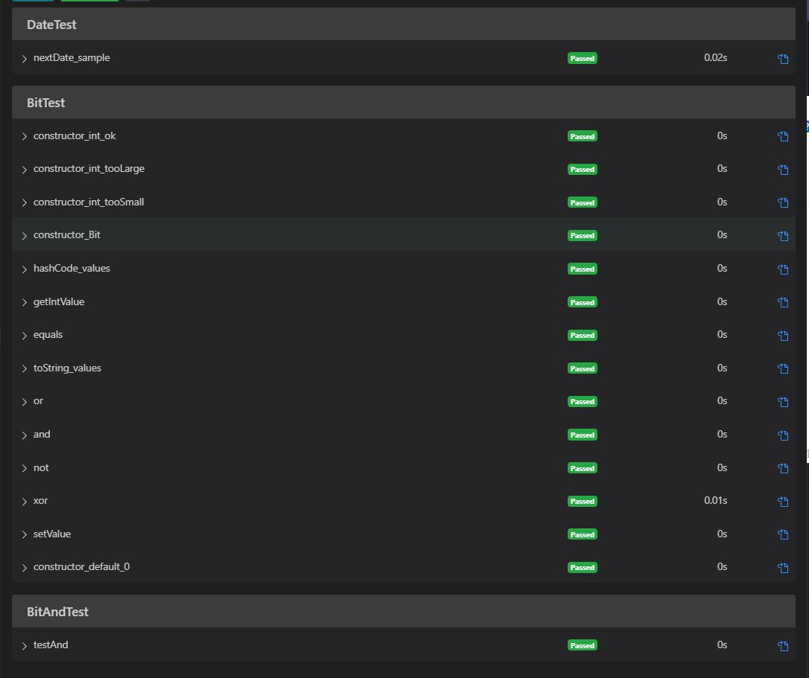
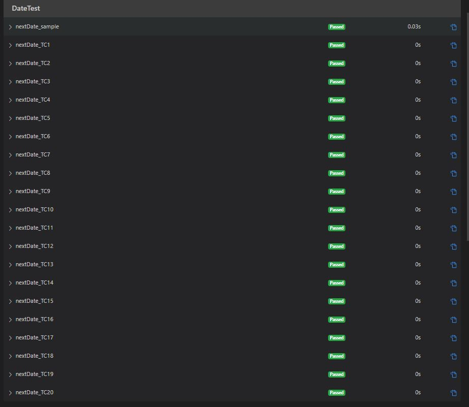
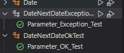

### EXERCISE 1:

| Test Case | Expected Results | Actual Results | Verdict (Pass, Fail,Inconclusive) |
|-|-|-|-|
| UserName: A00000 FirstName: "" LastName:"" Age:18 Email: +@-.AA City: Halifax PostalCode: A0A0A0 | registerstration request accepted | registerstration request accepted | Pass |
| UserName: zzzzzzzzzzzz FirstName: A LastName: zzzzzzzzzzzzzzzzz Age:64 Email: zzZZz.zz999@zzz.zzzz99999zzzzzzz.zzzzz zz9999zzzzz.zzzzzz City: Toronto PostalCode: Y9Z9Z9 | registerstration request accepted | registerstration request accepted | Pass |
| UserName: Aure723xxz FirstName: A LastName: Bob The Great Age:35 Email: boByy4534@some.where.com City: Ottawa PostalCode: A9A 9A9 | registerstration request accepted | registerstration request accepted | Pass |
| Additional test cases for valid inputs   UserName: A00000 FirstName: "" LastName:"A        " Age:18 Email: boByy4534@some.where.com City: Halifax PostalCode: A0A0A0 | registerstration request accepted | registerstration request accepted | Pass |
| UserName: A00000000000 FirstName: "" LastName:"" Age:19 Email: +@-.AA City: Halifax PostalCode: A0A0A0 | registerstration request accepted | registerstration request accepted | Pass |
| UserName: X56565z0 FirstName: Bond LastName: James Age:60 Email: jb007@mi6.org City: Montreal PostalCode: Y0Z 0Z0 | registerstration request accepted | registerstration request accepted | Pass |
| UserName:  FirstName:  LastName:  Age:18 Email: +@-.AA City: Halifax PostalCode: A0A0A0 | Err1 | Err1 | Pass |
| UserName: z FirstName: A LastName: zzzzzzzzzzzzzzzzz Age:64 Email: zzZZz.zz999@zzz.zzzz99999zzzzzzz.zzzzz zz9999zzzzz.zzzzzz City: Toronto PostalCode: Y9Z9Z9 | Err3 | Err3 | Pass |
| UserName: zzzzz FirstName: A LastName: Bob The Great Age:35 Email: boByy4534@some.where.com City: Ottawa PostalCode: A9A 9A9 | Err3 | Err3 | Pass |
| UserName: @adr278a FirstName: Bond LastName: James Age:60 Email: jb007@mi6.org City: Ottawa PostalCode: Y0Z 0Z0 | Err1 | Err1 | Pass |
| Additional test cases for invalid inputs:   UserName: X56565z0 FirstName: Bond LastName: James Age: Email: jb007@mi6.org City: Ottawa PostalCode: Y0Z 0Z0 | err2 | err2 | pass |
| UserName: X5656 FirstName: Bond LastName: James Age:60 Email: jb007@mi6.org City: Ottawa PostalCode: Y0Z 0Z0 | err2 | err2 | pass |

### EXERCISE 2:
after compile and run the tests

this is a capture after implement and test for 20 test case (16 to 20 expepect IllegalArgumentException ) in DateTest

Parameterized tests in DateNextDateOkText using stream arguments. It was tested and no error detech

