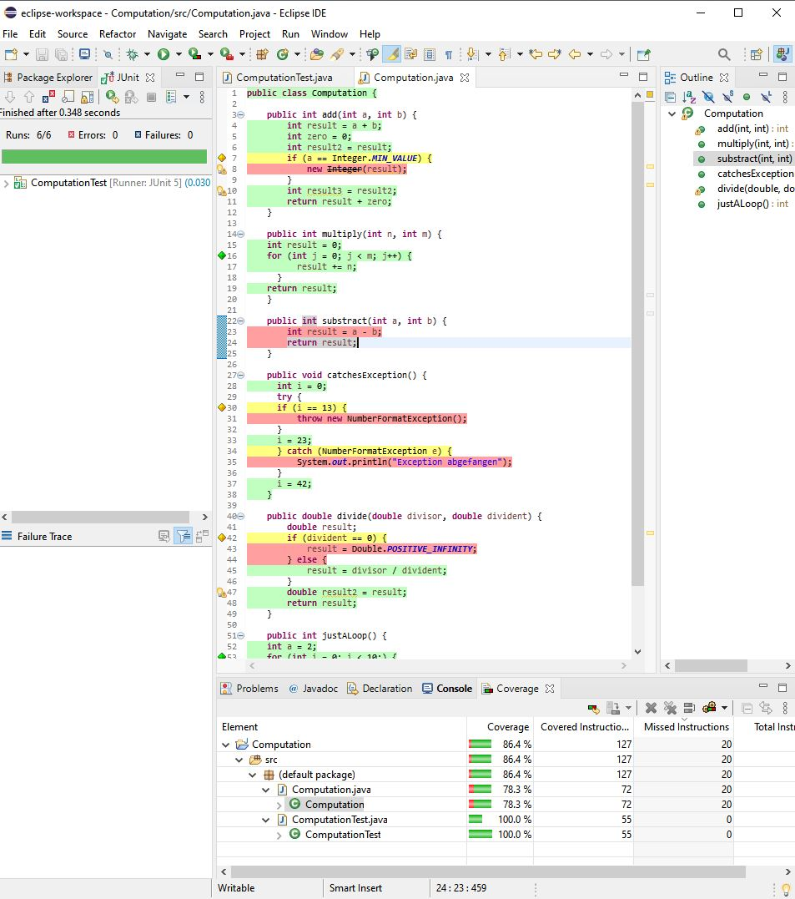

# Lab3_MinhDang_300030552

TA zkaka044@uottawa.ca ; Prof aforward@uottawa.ca aforward@uottawa.ca; class csi 3103

# Exercise 1 : 

Iam currently using java 15 and try eclipse version march 2021 with jacoco to test computation.java file 

I have to restart and redirect the java library file after install the jacoco

