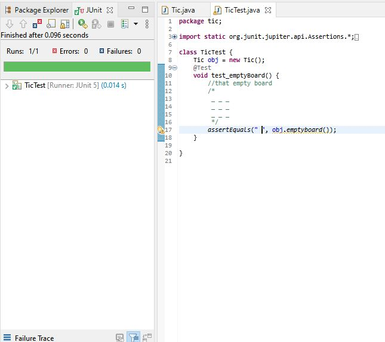
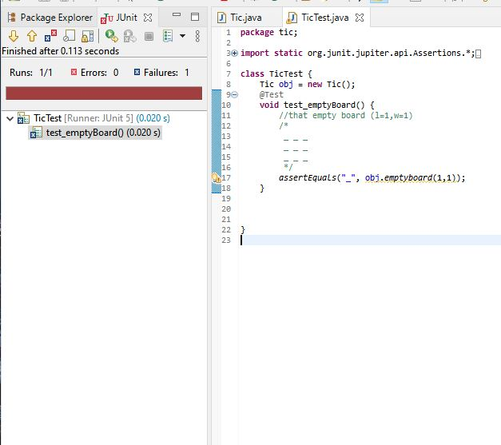
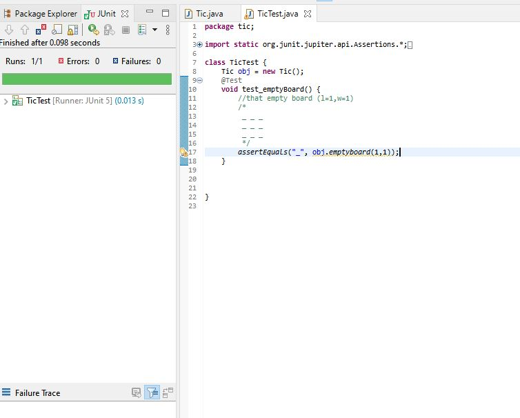
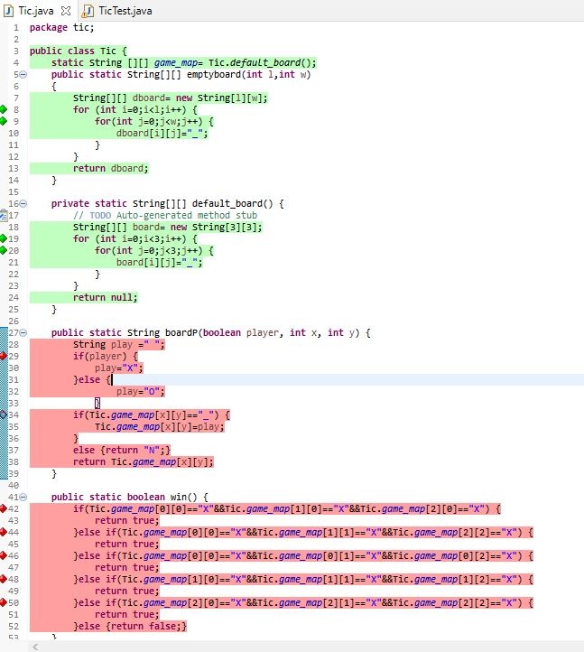
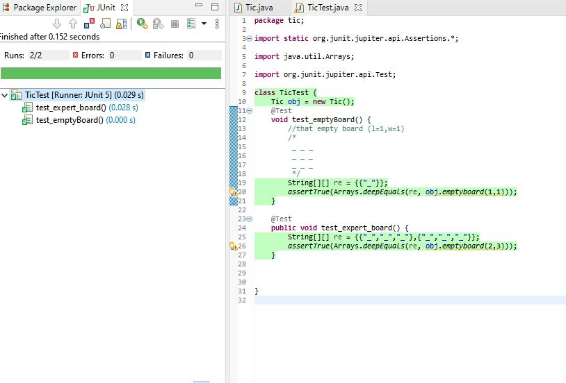
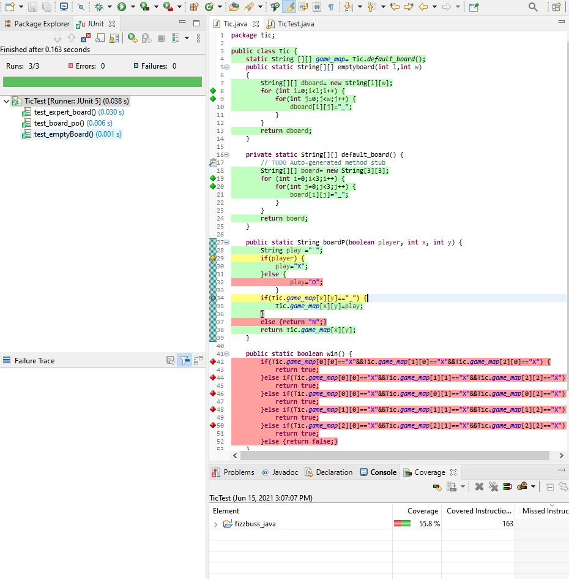
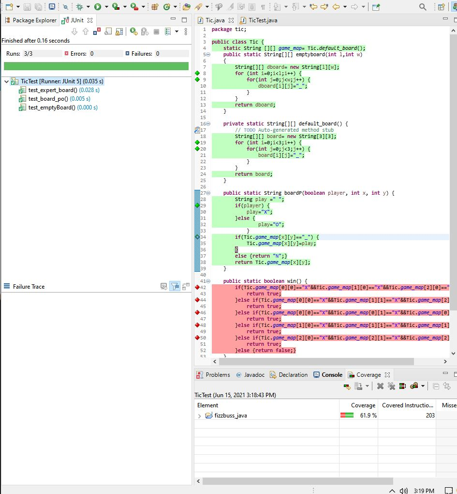

Lab1 TA zkaka044@uottawa.ca ;
Prof aforward@uottawa.ca <aforward@uottawa.ca>;
class csi 3103

I am sorry for late submission, I was in the hospital for vacine reaction so I couldnt submit the lab 4

### EXERCISE 1:
 I Create /lab04 directory and extracted tic.zip and fizzbuzz.zip

 after that I created tic_java and fizzbuzz_java

I make and commit emptyboard test (works)

I tried to add more dimension to the emptyboard test and commited but failed

try to pass and commited again and it works

after implement tic.java I wrote some test and need to change assert equal to deep equals since 2D array need to deep equal or 
else it was compare 2 address instead.

after implement BoardP and test player1 play at pos 1,0 here it the coverage and test result of board_po

and this is after player 2 play at position 1,0

finally this is after the game end

