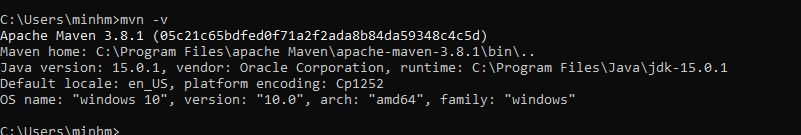
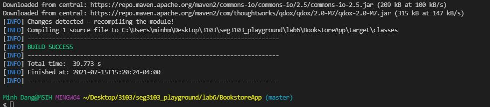
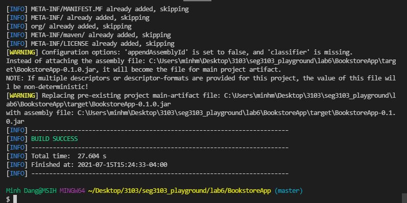
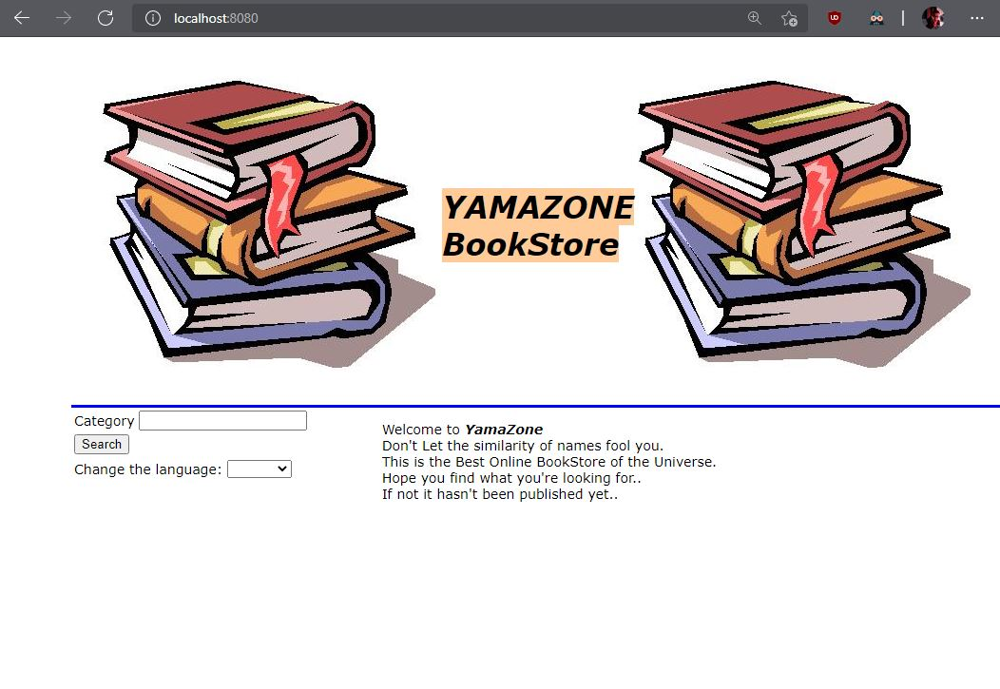
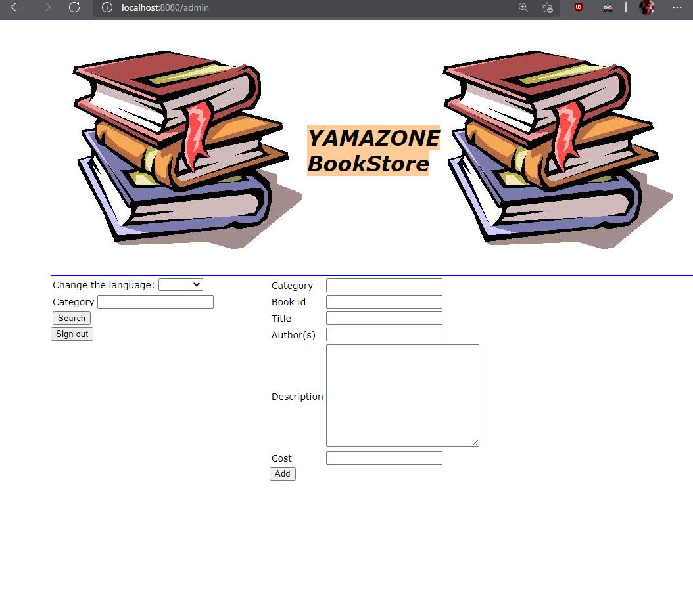
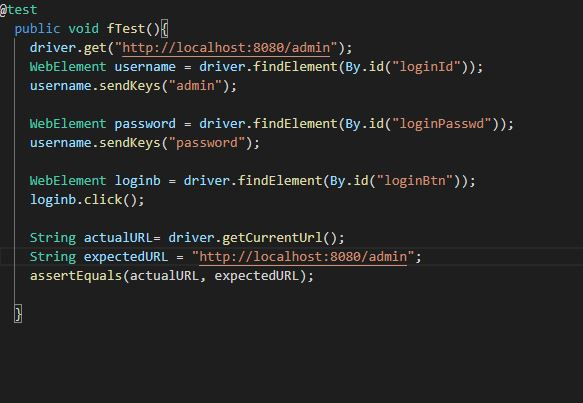
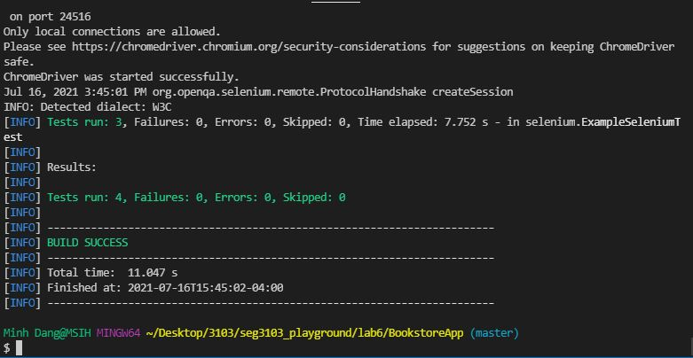
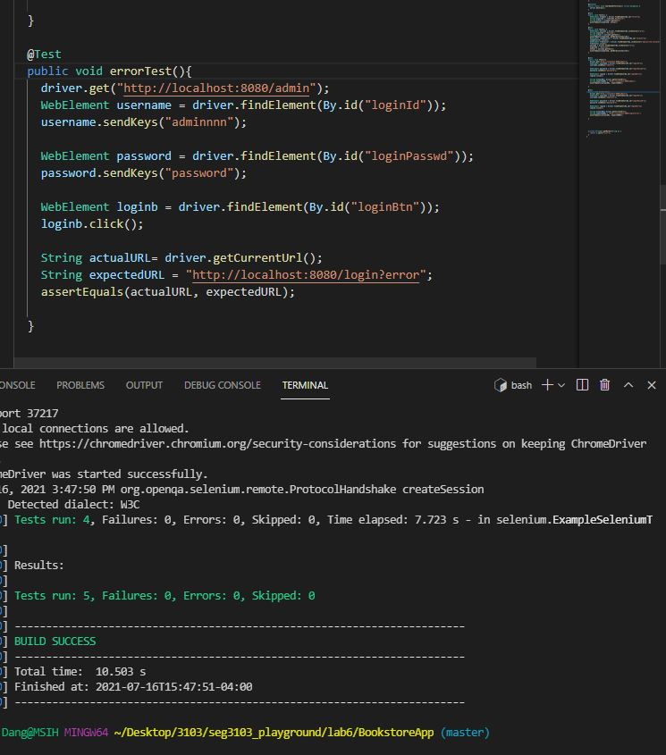

Lab6 TA zkaka044@uottawa.ca ;
Prof aforward@uottawa.ca <aforward@uottawa.ca>;
class csi 3103

First I tried to installed binary zip achive of maven and added to ivironment variable. then I checked with command mvn -v 
on shell and it indicated that maven 3.8.1 is in my system

next I extectacted the project and tried to build using vscode using command mvn compile
it downloaded alot more dependencies (not just the achive zip) and later on i was succeded

next I used command mvn package -DskipTests to package all the project file on 1 java file

next i used java -jar ./target/BookstoreApp-0.1.0.jar to create a local server

access admin page by /admin

next I wrote my first test into exapleSeleniumTest.java of login by admin

and run mvn test and it sccussed

next I worte one more test which admin have the correct password but wrong username for login error test

