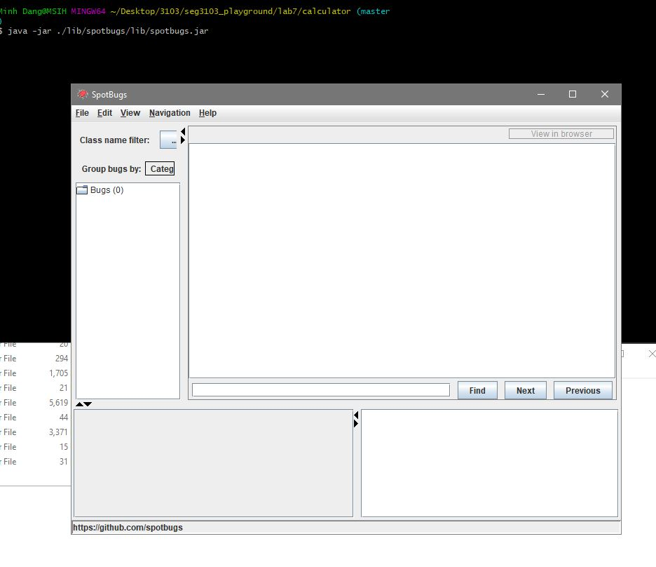

Fisrt of all I extracted the calcuator and make sure that spotbugs work 
by the command java -jar ./lib/spotbugs/lib.spotbug.jar

Then I tried to compile the caculator app and test file before linking

Next I create a spotbugs project and link the project to the caculator app and try to compile

first bug is compareing string but using == operator (change to .equals and test back)
fixxing first dodgy code by combine both esle statement into one
switch statement found in line 329 missing default been added.
all condition has no effect is deleted the first statements as it was narrowed by the previous statement already
change else if true to else con line 302 as it was always true dont need condition anymore

I tried to run the spot bug again but it still show the old code when i already fixed the source code 